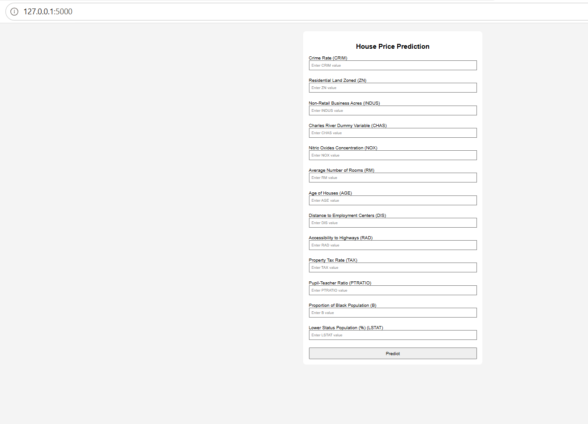
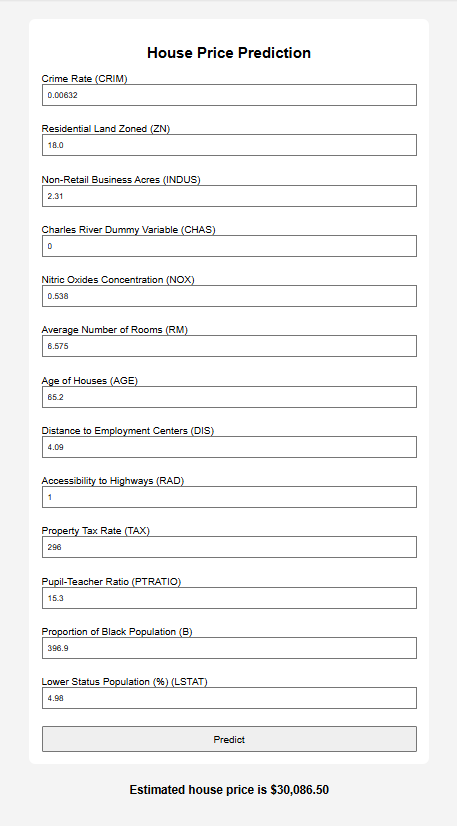

# Boston House Price Prediction

## Overview

This project develops an end-to-end machine learning solution to predict housing prices in Boston using various socioeconomic, environmental, and property-related features. The project covers the complete machine learning workflow, including data preprocessing, exploratory data analysis, model training, evaluation, and deployment using Flask.

The final application allows users to enter housing characteristics through a web interface and receive an estimated house price prediction in real time.

## Problem Statement

Accurately estimating house prices is important for buyers, sellers, real estate agencies, and financial institutions. Housing prices are influenced by multiple factors such as crime rate, accessibility, property taxes, room count, and neighborhood characteristics.

The objective of this project is to build a predictive model that can estimate house prices based on these factors and provide an easy-to-use web application for generating predictions.

## Dataset

The project uses the Boston Housing Dataset, which contains information collected from various suburbs in Boston.

### Features

Feature	Description
- CRIM	Crime rate per capita
- ZN	Residential land zoned for large lots
- INDUS	Proportion of non-retail business acres
- CHAS	Charles River dummy variable
- NOX	Nitric oxide concentration
- RM	Average number of rooms per dwelling
- AGE	Proportion of owner-occupied units built before 1940
- DIS	Distance to employment centers
- RAD	Accessibility to radial highways
- TAX	Property tax rate
- PTRATIO	Pupil-teacher ratio
- B	Demographic-related feature from the original dataset
- LSTAT	Percentage of lower-status population

Target Variable
- PRICE (Median value of owner-occupied homes)
Values are measured in thousands of dollars.

## Project Workflow

1. Data Collection
- Loaded the Boston Housing dataset.
- Performed initial inspection and validation.
2. Exploratory Data Analysis (EDA)
- Analyzed feature distributions.
- Visualized correlations between variables.
- Identified relationships between housing prices and key predictors.
3. Data Preprocessing
- Checked for missing values.
- Applied feature scaling using StandardScaler.
- Prepared data for machine learning algorithms.
4. Model Training
- Split the dataset into training and testing sets.
- Trained a Linear Regression model.
- Generated predictions on unseen data.

5. Model Evaluation

The model was evaluated using:
- Mean Absolute Error (MAE)
- Root Mean Squared Error (RMSE)
- R² Score

Results:
- R² Score: 0.711
- MAE: 3.16
- RMSE: 4.60

The model explains approximately 71% of the variation in housing prices.

6. Model Deployment
- Saved the trained model using Pickle.
- Built a Flask web application.
- Created an HTML frontend for user interaction.

## Technologies Used
### Programming Language
- Python

### Libraries
- NumPy
- Pandas
- Matplotlib
- Seaborn
- Scikit-learn
- Pickle

### Web Framework
- Flask

### Development Tools
- VS Code
- Jupyter Notebook
- GitHub

## Key Insights
### Positive Relationship with House Prices
- RM (Average Number of Rooms) showed a positive correlation with housing prices.
- Homes with more rooms generally had higher market values.
### Negative Relationship with House Prices
- LSTAT (Lower Status Population Percentage) demonstrated a strong negative correlation with housing prices.
- Areas with higher LSTAT values tended to have lower property values.
### Additional Observations
- Crime rate negatively impacted housing prices.
- Accessibility and neighborhood-related factors influenced property valuation.
- Multiple factors jointly contribute to housing price prediction.

## Project Structure
```text   
 Boston-House-Price-Prediction/
│
├── app.py
├── regmodel.pkl
├── scaler.pkl
├── requirements.txt
│
├── templates/
│   └── home.html
│
└── notebooks/
    └── HousePricePrediction.ipynb
│
├── screenshots/
│   └──home_page.png
│   └──prediction.png
│    └──prediction_result.png
├── README.md

```
## Application Screenshots
### Home Page


### Prediction Result



## How to Run the Project

### Clone Repository
git clone https://github.com/AjitaGiri/Boston-House-Price-Prediction.git

cd Boston-House-Price-Prediction

### Create Virtual Environment
python -m venv venv

### Activate Environment
venv\Scripts\activate

### Install Dependencies
pip install -r requirements.txt

### Run Application
python app.py

### Open your browser and visit:

http://127.0.0.1:5000

## Future Improvements
- Experiment with advanced regression models such as Random Forest and XGBoost.
- Improve frontend design and user experience.
- Deploy the application to a cloud platform.
- Add automated input validation and monitoring.
- Compare multiple machine learning algorithms.